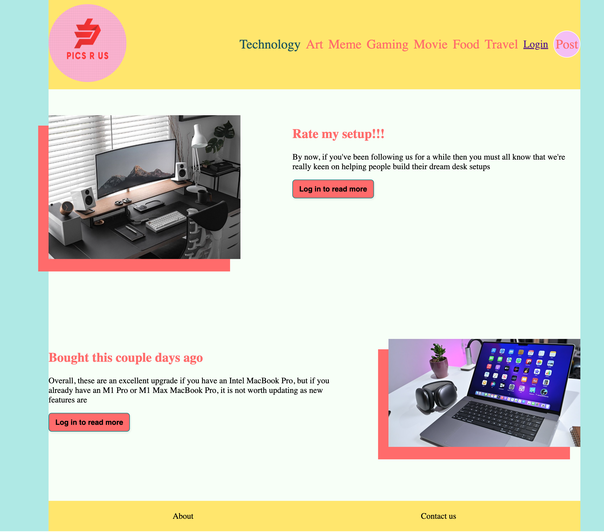
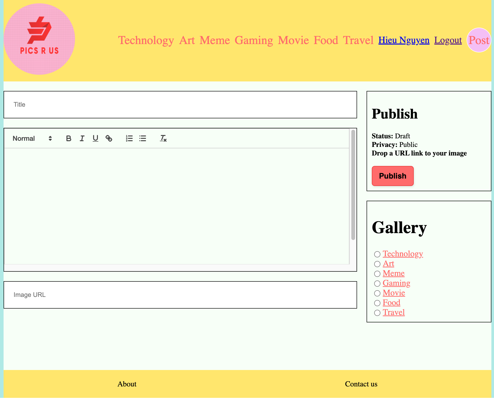

# pics R us - frontend

## Description
Pics-R-Us was made to interact and explore pictures and posts of a certain interest that is displayed through a gallery. This site allows users to create a profile, interact to any posts in any gallery, while being able to curate your own gallery of choice as well. This application will allow user to share photos to other user with the same interested without having them as a friend.

## Table of Contents
- [Installation](#installation)
- [Usage](#usage)
- [Credits](#credits)
- [License](#license)

## Installation
Clone this repository to your local machine.
Run npm install or npm i in order to install the npm package dependencies as specified in the package.
This is a full stack application with a deployed link: https://picrus.netlify.app/?gallery=technology

## Usage
From the start of the home page, you have various options of galleries to choose from the navigation bar.
- HOME PAGE:

At the homepage user will render technology page as default. User will have option to login to be able to see more detail about specific post.
User can click on the big logo on top-right corner to go back to the homepage at anytime.
If users are login they can click on their username on the navigation bar to go to their profile page.

- PICTURE PAGE:

When user click on the specific post they will see the picture, the name and avatar of the owner. If user click on the name of the owner it will take them to the owner profile page.
If users are the owners of the post they will have an option to edit the post or delete it.
On the right side is the menu where it will suggest posts that you may like with the same gallery and user also have an option to click on the button to see it.

- UPLOAD PAGE:

When user click on the post button on the top-left corner they will be taken to upload page where they will be asked to type in the title of the photo, description and URL link of their photo to share their photo.

- PROFILE PAGE:

Profile page will show the avatar, the name of the user and how many post do they have.
Profile page will also render all the post of the user from different gallery.

## Credits
Collaborators -
Hieu Nguyen: https://github.com/HieuNguyen1905
Julian Mason: https://github.com/JulianKM
Tyler Vu: https://github.com/tvu328